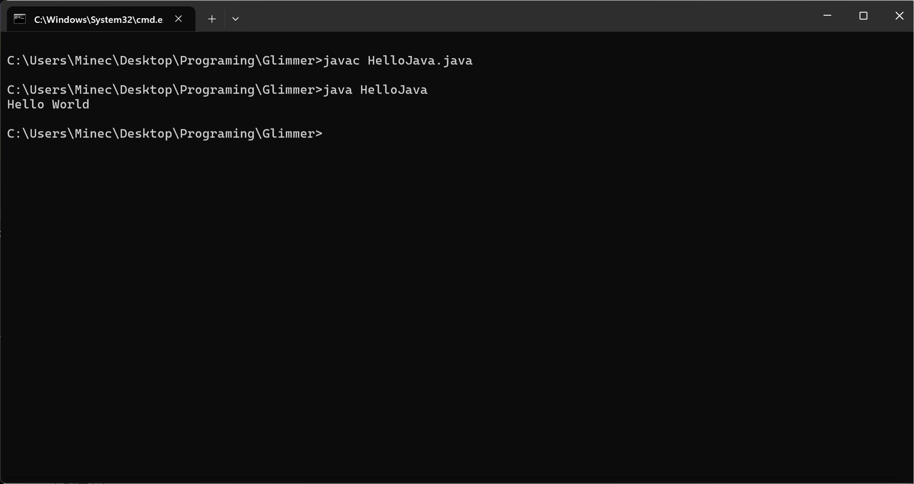

问题回答
1. JDK是java开发工具包，JRE是java运行时环境，JVM是java虚拟机。JDK包含JRE包含JVM。代码通过javac编译后，可以在JRE提供的核心类等支持下，在JVM下跑起来
2. 在Path环境变量里添加了java的bin文件夹路径。配置环境变量之后，输入如java命令时，命令行就会先到环境变量中添加的的路径找java程序，所以可以使用相关命令
3. 
4. javac.exe用来编译.java文件，java.exe用来在控制台执行.class文件，cmd.exe用来呈现程序的输出。.java文件用来存人写的代码，.class文件是javac编译后的产物，可以被java.exe执行